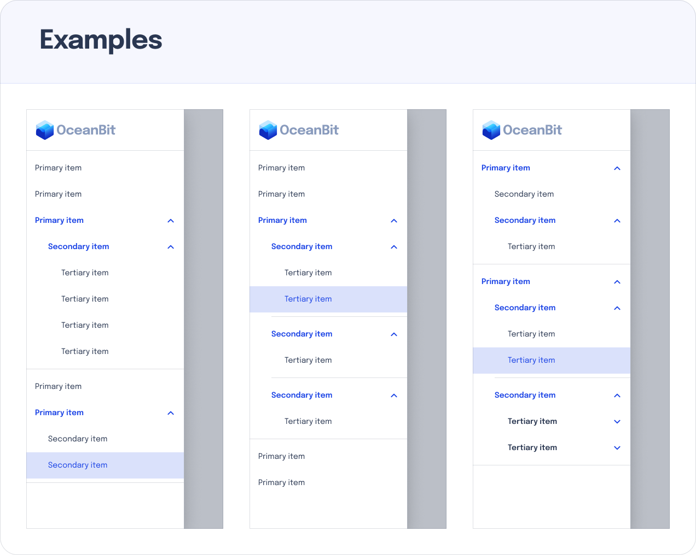
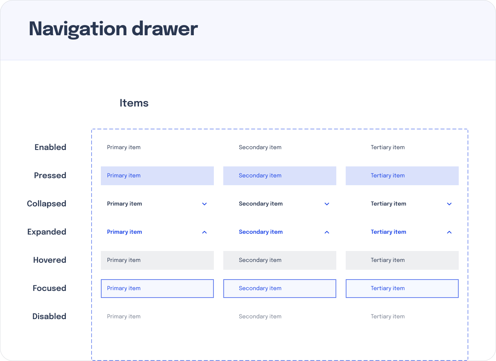

# Seaside Drawer Component

This is a feature complete drawer component that I built for [OceanBit's](https://oceanbit.dev/) UI library, [Seaside](github.com/oceanbit/seaside).

This set of components supports:
- Proper focused state
- Proper hovered state
- Proper `SidebarItem` disabling
- Support for infinite depth recursion
  - This means you can stack `SidebarItems` within other `SidebarItems`.

## API

```tsx
import { Sidebar, SidebarDivider, SidebarItem, CollapsableSidebarItem } from '../components';

const App = () => {
    return (
        <Sidebar>
            Header
            <SidebarDivider/>
            <SidebarItem text="Primary" />
            <CollapsableSidebarItem text="Primary">
                <SidebarItem text="Secondary" />
            </CollapsableSidebarItem>
        </Sidebar>
    );
};
```

## Screenshots

